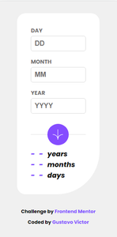

# Frontend Mentor - Age calculator app

Este projeto é uma solução do desafio [Age calculator app](https://www.frontendmentor.io/challenges/age-calculator-app-dF9DFFpj-Q) do Frontend mentor que é  uma plataforma de desafios que te ajuda a melhorar suas habilidades de codificação e desenvolviemnto através da construção de projetos reais. 

## Tabela de conteúdos

- [Visão Geral](#-visão-geral)
  - [O desafio](#o-desafio)
  - [Screenshots](#screenshots)
  - [Links](#links)
- [Meu processo](#-meu-processo)
  - [Tecnologias](#tecnologias)
  - [Fontes](#fontes)
  - [Ferramentas](#ferramentas)
- [Autor](#-author)
- [Licença](#-licença)

## 💻Visão Geral

### O desafio

Usuários são capazes de:

- [x] Ver a idade em anos, meses e dias depois de enviar uma data válida no formulário
- [x] Receber validações de erro se: 
  - [x] Qualquer campo estiver vazio
  - [x] O dia não está entre 1 e 31
  - [x] O mês não está entre 1 e 12
  - [x] O ano está no futuro
  - [x] A data for inválida. Ex: (31/04/2023) - Abril só tem 30 dias
- [x] Ver layout otimizado para dispositivos de tela com tamanhos diferentes

### Screenshots

 

### Links

- [Aplicação no Github Pages](https://gustavovictor.me/age-calculator-app/)

## 🛠Meu processo

### Tecnologias

- [HTML5](https://developer.mozilla.org/pt-BR/docs/Web/HTML)
- [CSS](https://developer.mozilla.org/pt-BR/docs/Web/CSS) 
- [JS](https://www.javascript.com/)  

### Fontes

- [Poppins (400i, 700, 800i)](https://fonts.google.com/specimen/Poppins) 

### Ferramentas

- [Visual Studio Code](https://code.visualstudio.com/)

## 🦸‍♂️Autor

- Website - [gustavovictor](http://gustavovictor.me/)
- Frontend Mentor - [@Gustavo-Victor](https://www.frontendmentor.io/profile/Gustavo-Victor)
- CodePen - [@gustavo_victor](https://codepen.io/gustavo_victor)

## 📋Licença

Este projeto está sob a licença [MIT](./LICENSE.md) 

Qualquer pessoa pode usar e contribuir com este projeto ✌

